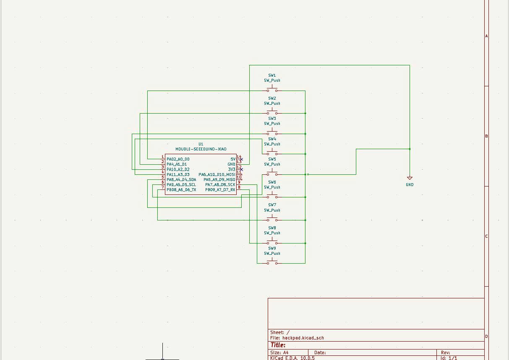
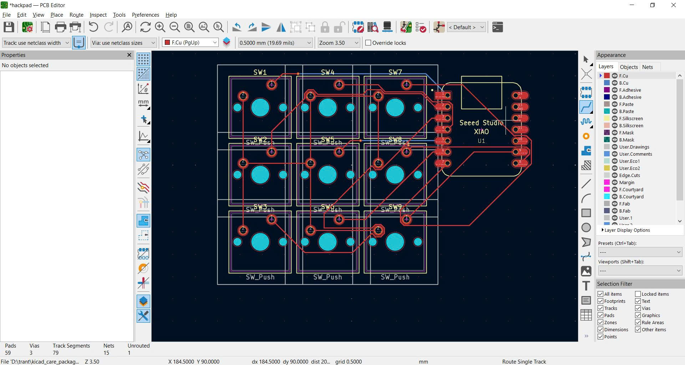
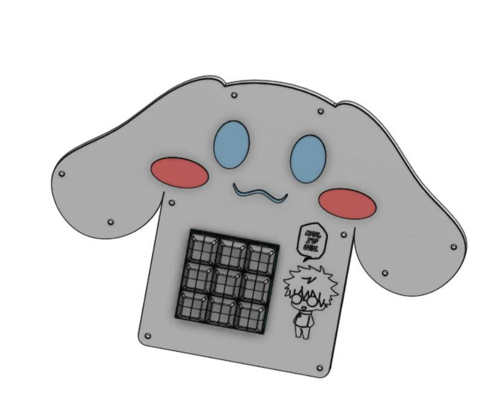

# Cinnamoroll Hackpad

This is my first hardware project and my first macropad. The intent was to make a cute 3x3 macropad to ease my workflow and serve as a custom input device.

## Specifications

### BOM
- 1x Seeed Studio XIAO RP2040
- 9x Cherry MX Switches
- 9x 1U Keycaps
- 4x M3 Screws

## Schematic

## PCB

## Case
- **Onshape Design Link:** [Click here to view 3D Model](https://cad.onshape.com/documents/b921f1c5d64ee8a8ffecabd9/w/165d38f25561d370d67a0145/e/40be511a874d06610ecdcc83?renderMode=0&uiState=6a82b7377af9117db155d383)

## Source and Reference
- https://hackpad.hackclub.com/
- https://wiki.seeedstudio.com/XIAO-RP2040/
- https://www.onshape.com/en/
